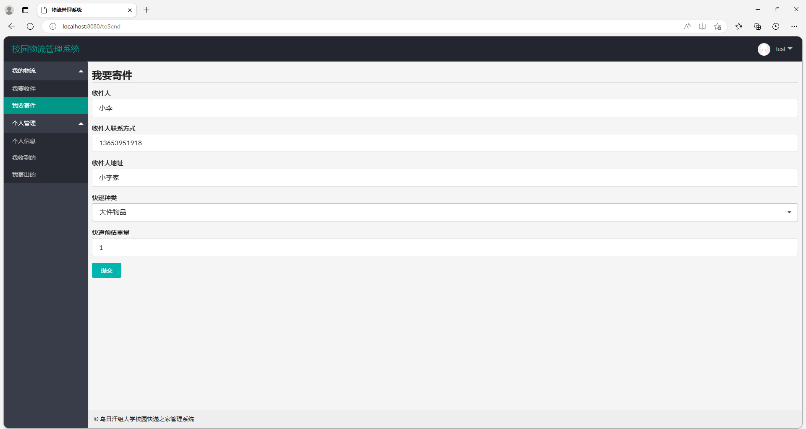
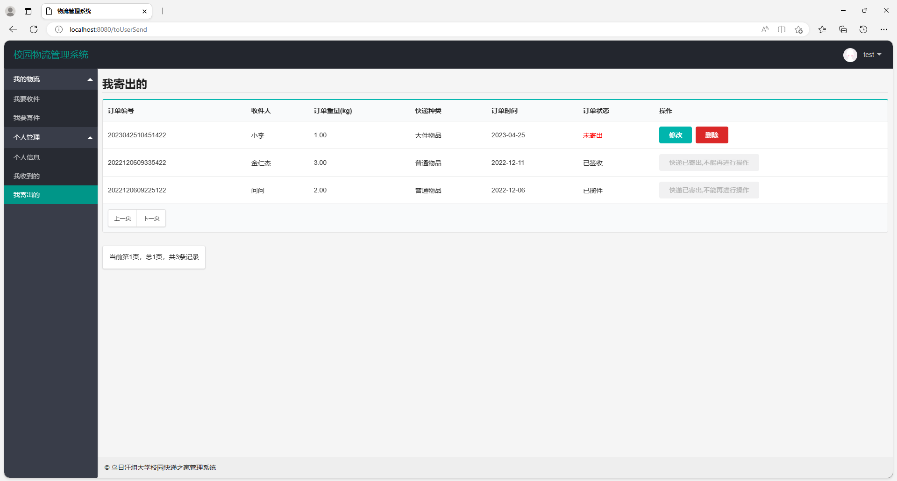
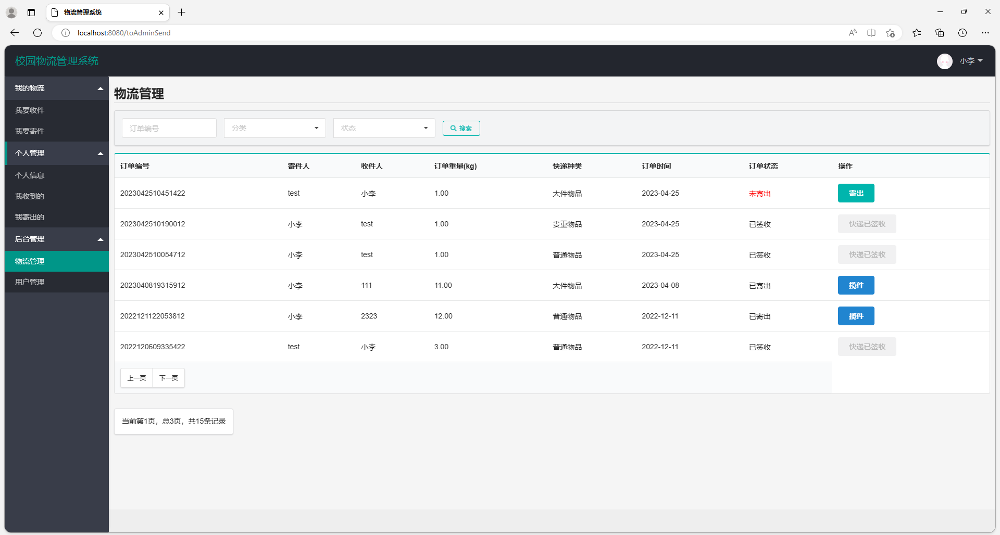
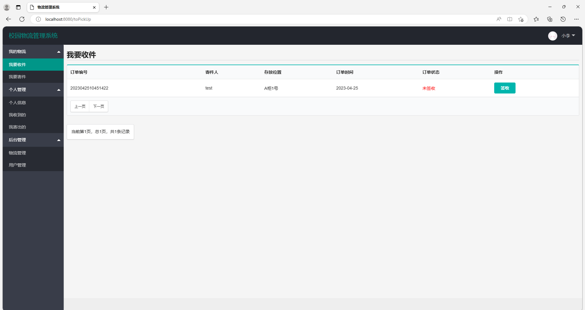
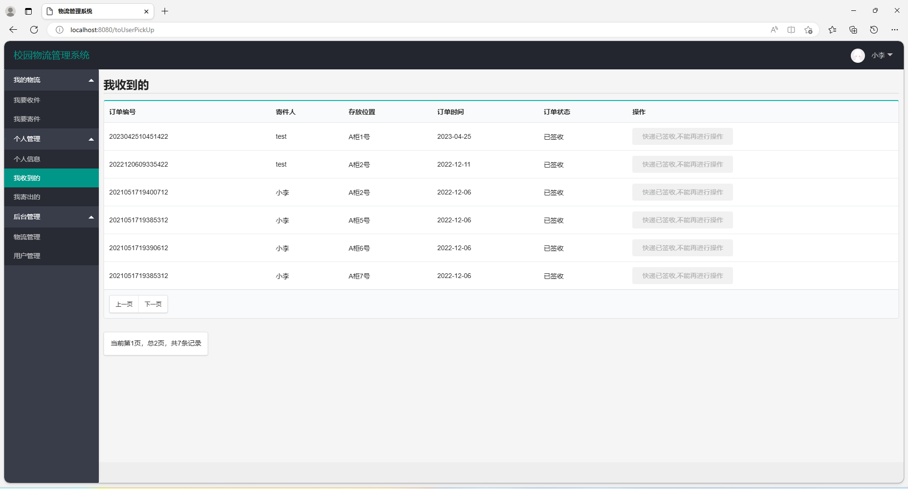

# 校园快递管理系统

## 一、项目介绍

基于springboot的校园快递管理系统

数据库:mysql

开发语言：java

项目技术

SpringBoot+MybatisPlus+Thymeleaf+jquery+layui

主要功能
我的物流
我要收件
我要寄件
个人管理
个人信息
我收到的
我寄出的
后台管理
物流管理
用户管理

### 完整项目获取

通过网盘分享的文件：校园快递管理系统

链接: https://pan.baidu.com/s/14JGQ9uIU35-vaGAO1IeTCw?pwd=g3cc 提取码: g3cc
--来自百度网盘超级会员v3的分享

通过网盘分享的文件：工具包

链接: https://pan.baidu.com/s/1YmdoJvkjoUjA75wvHLDZ6A?pwd=xm96 提取码: xm96
--来自百度网盘超级会员v3的分享

通过网盘分享的文件：远程调试部署联系方式

链接: https://pan.baidu.com/s/1W0dDcoZmayG0c7USJDYBYg?pwd=nqd7 提取码: nqd7
--来自百度网盘超级会员v3的分享

### 项目合集(项目不断更新中)
链接: https://pan.baidu.com/s/1nY-zhvAK0CXYcn3g7LzQnQ?pwd=id3c 提取码: id3c
--来自百度网盘超级会员v3的分享

#### 这些项目一起发你了 可以分享给你需要的同学 调试可找我 也接二次修改和项目定制、毕业设计等

## 接毕业设计和论文

微信联系方式：xzxj0206  QQ：3808981644   (支持修改、 部署调试、 支持代做毕设)

接网站建设、小程序、H5、APP、各种系统等，单片机、嵌入式也可以做

选题+开题报告+任务书+程序定制+安装调试+论文+答辩ppt  都可以做

## 二、系统部分功能页面截图

### 1、用户模块部分功能页面截图

### 管理员模块部分功能页面截图

